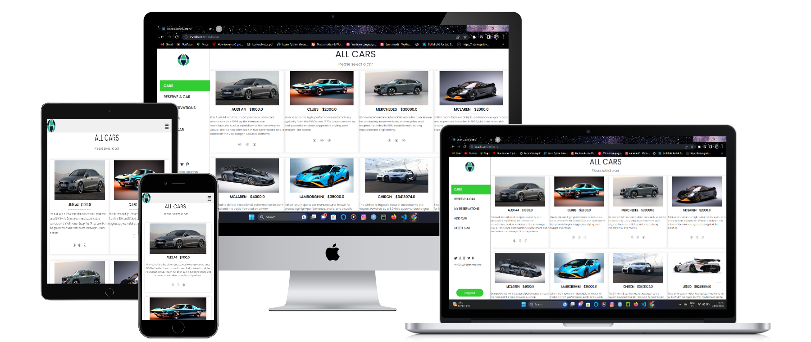
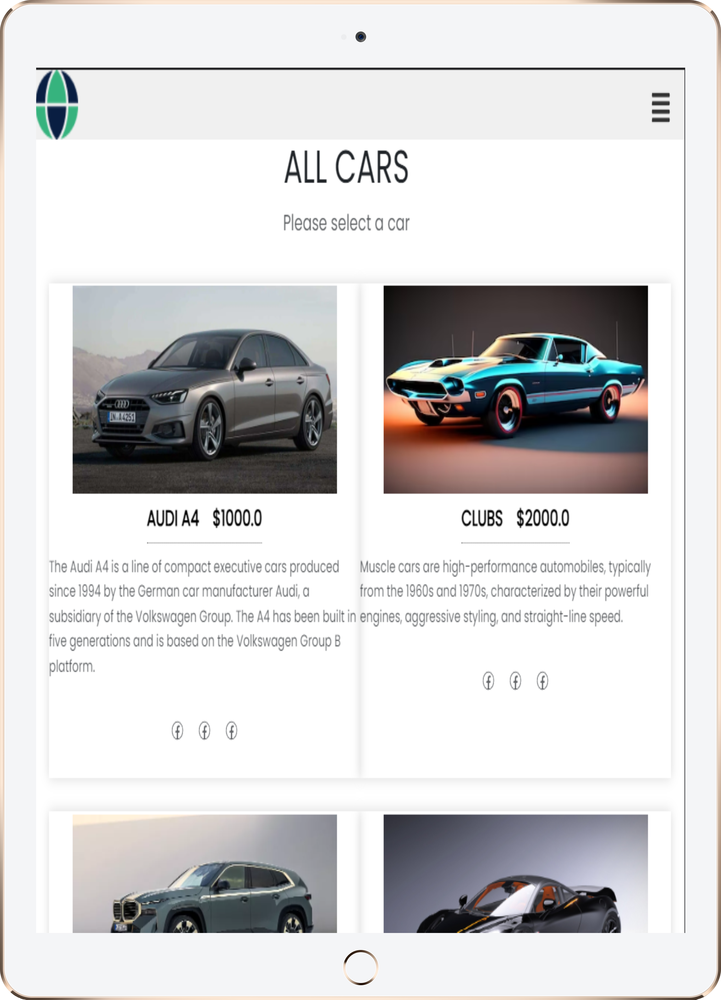
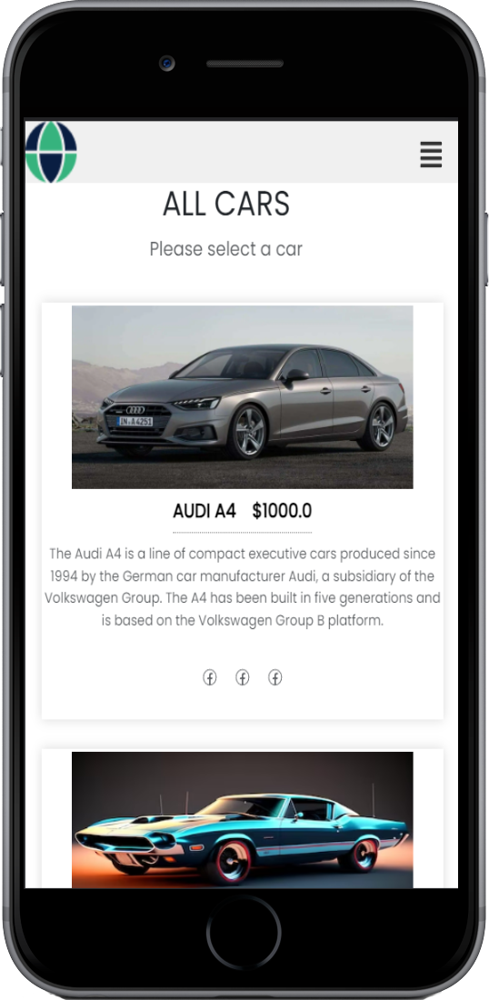

# 📗 Table of Contents
- [App Mock](#app-mock)
- [📖 About the Project](#about-project)
  - [🧪 Linters](#linters)
  - [🛠 Built With](#built-with)
    - [Tech Stack](#tech-stack)
    - [Key Features](#key-features)
  - [🚀 Live Demo](#live-demo)
- [💻 Getting Started](#getting-started)
  - [Setup](#setup)
  - [Prerequisites](#prerequisites)
  - [Install](#install)
  - [Usage](#usage)
  - [Run tests](#run-tests)
- [👥 Authors](#authors)
- [🚀 Presentation And Live Demo](#video-presentation-for-our-project)
- [🔭 Future Features](#future-features)
- [🤝 Contributing](#contributing)
- [⭐️ Show your support](#support)
- [🙏 Acknowledgements](#acknowledgements)
- [📝 License](#license)

<!-- PROJECT DESCRIPTION -->

#  App mock

  
  
  

# 📖 Booking App Frontend 

Welcome to the frontend of the Booking Cars Project, a cutting-edge application built using React and Redux technologies. Here, you can easily browse and reserve cars of your choice by selecting your preferred date and city for pickup, as well as specifying the return date.
Our user-friendly interface allows you to explore a diverse range of cars with detailed information. You can make informed decisions based on real-time availability, ensuring a seamless reservation process.
For added convenience and efficiency, certain pages within the app are restricted and can only be accessed by authorized admins. Admins have the privilege to add new cars to the inventory and delete existing ones, ensuring that the fleet is always up-to-date and well-maintained.

# [🤝 Booking App Backend](https://github.com/enis-memic/booking_app_api) 

[Booking App Backend](https://github.com/enis-memic/booking_app_api) is just the end point of all the functionality on the Frontend app it is build on Ruby on rails using postgresql as a Database. Proper authorizations of users and authentication of user for creation reservations, cars and cancel them according to role 

## 🧪 Linters 

## 🛠 Built With 

### Tech Stack 

In this project we utilize our skills and knowledge to create this project

  
Project language 

  <ul>
    <li><a href="https://www.javascript.com/">JavaScript</a></li>
  </ul>

  
FrameWork

  <ul>
    <li><a href="https://react.dev/">React</a></li>
  </ul>

  
DataBase

  <ul>
    <li><a href="postgresql.org/">Postgres</a></li>
  </ul>

  
Backend FrameWork

  <ul>
    <li><a href="https://rubyonrails.org/">ROR</a></li>
  </ul>

<!-- Features -->

### Key Features 

- *log in*
- *Sign in*
- *Responsive*
- *Get Cars*
- *Reserve Cars*
- *Cancel Reservation*

## 🚀 Live Demo 

Currently, the live version of the app is not available. However, you can still view the app by following the provided prerequisites and process. Unfortunately, having a live version of a full-stack app can be quite expensive. I hope you understand the limitations we are facing. We are continuously working to improve the app and make it more accessible to everyone. Thank you for your patience and understanding.

(<a href="#readme-top">back to top</a>)

<!-- GETTING STARTED -->

## 💻 Getting Started 

To get a local copy up and running, follow these steps.

### Prerequisites

In order to run this project with the [backend Repo](https://github.com/enis-memic/booking_app_api) you need:

- Node installed in your machine
- Ruby installed in your machine
- Ruby on Rails installed in your machine
- Postgres installed and all password and user being setup
- Any integrated terminal like 
  - CMD `preferred`
  - Bash`preferred`
  - PowerShell
  - etc

### Setup

Clone this and [Backend Repo](https://github.com/enis-memic/booking_app_api) repository to your desired folder:

for cloning follow this steps
- go to green `code` button very top left corner of this Repository container
- copy your `SSH` or `https` file and clone it in your desired folder 
- or just download `ZIP` file
- Create `.env` file in root directory and add this line there `port=8000` 

*Note* for [backend repo](https://github.com/enis-memic/booking_app_api) follow there prerequisites
### Install

Install this project with:

for now you don't need any installation to run project if you already followed [Prerequisites](#prerequisites)

just few dependency packages 

npm install

### Usage

To run the project, execute the following command:

npm start // to start development server
npm run build // to build for productions

(<a href="#readme-top">back to top</a>)

<!-- AUTHORS -->

## 👥 Authors 

👤 *Adarsh Pathak*

- GitHub: [@PowerLevel9000](https://github.com/PowerLevel9000)
- Twitter: [@PowerLevel9002](https://twitter.com/PowerLevel9002)
- LinkedIn: [Adarsh pathak](https://linkedin.com/in/PowerLevel)
- GitUp Page: [Portfolio Page](https://powerlevel9000.github.io/portfolio-project/)

👤 *Enis Memic*

- GitHub: [@enis-memic](https://github.com/enis-memic)
- LinkedIn: [enis-memic](https://linkedin.com/in/enis-memic)

👤 *Habtamu Birru*

- GitHub: [@Habtamu210](https://github.com/Habtamu210)
- Twitter: [@beleyaha](https://twitter.com/beleyaha)
- LinkedIn: [@habtamu-](https://www.linkedin.com/in/habtamu-birru/)

👤 *Musong Ernest*

- GitHub: [@ernestmusong](https://github.com/ernestmusong)
- Twitter: [@MusongAkeh](https://twitter.com/MusongAkeh)
- LinkedIn: [Musong Ernest](https://www.linkedin.com/in/musongernestakeh/)

(<a href="#readme-top">back to top</a>)

## 🔭 Future Features 

- [ ] *Styling of various webpage*
- [ ] *Better login and authorization*

(<a href="#readme-top">back to top</a>)

<!-- CONTRIBUTING -->

## 🤝 Contributing 

Contributions, issues, and feature requests are welcome!

Feel free to check the [issues page](../../issues/).

(<a href="#readme-top">back to top</a>)

<!-- SUPPORT -->

## ⭐️ Show your support 

If you like this project please give it star or buy a coffee for us

(<a href="#readme-top">back to top</a>)

<!-- ACKNOWLEDGEMENTS -->

## 🙏 Acknowledgments 

I would like to thank microverse for giving this opportunity to show up my skills

and the <a href="https://guides.rubyonrails.org/getting_started.html"> Ruby on rails docs </a>

moving further I want to thank [muratk Korkmaz on Behance](https://www.behance.net/muratk) the [author of the original design](https://www.behance.net/gallery/26425031/Vespa-Responsive-Redesign) for App Inspiration

(<a href="#readme-top">back to top</a>)

<!-- LICENSE -->

## 📝 License 

This project is [GENERAL PUBLIC LICENSE](./LICENSE) licensed.

(<a href="#readme-top">back to top</a>)

